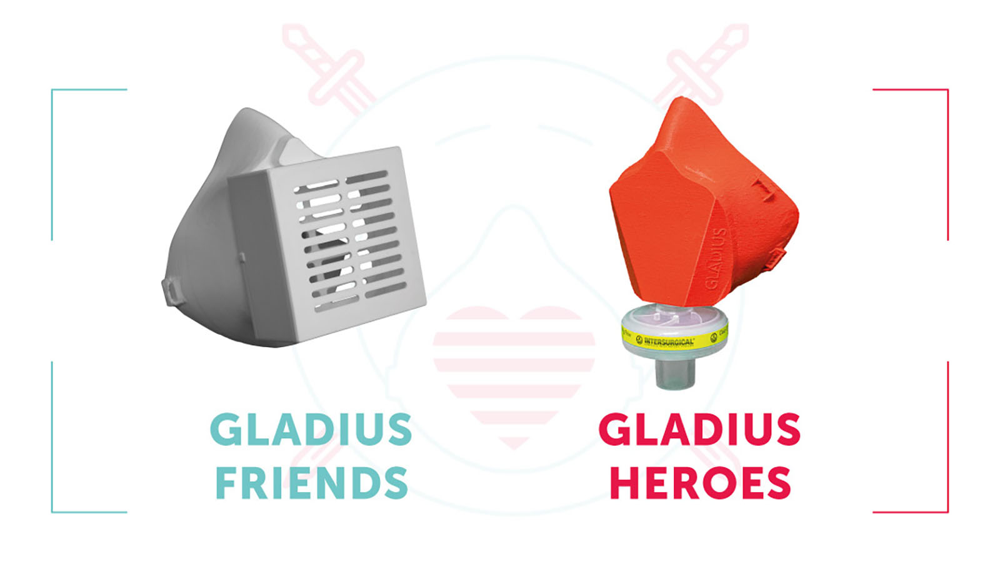

# GLADIUS | Open Source 3D printed protective gear

Visit [gladius.si](http://gladius.si/) for more details about our project.

## [Gladius Heroes respirator mask](https://gladius.si/#-gladius-heroes-respirator-mask)
Gladius Heroes respirator mask is a prototype of a mask utilizing existing filters used for ventilators (see details about filters below) and it is intended for the front line heroes working in healthcare industry.

## [Gladius Friends respirator mask](https://gladius.si/#-gladius-friends-respirator-mask)

Gladius Friends respirator mask is a mask for everybody that has access to 3D printer or 3D printing service. The mask is reusable and can be fitted with a variety of filter materials for everyday use.

***

## Disclamer

The participants of this project do not take any responsibility for the use, use cases, dangers from the manufacturing process, and outcomes of wearing this design (or designs derived from it), in any way, shape, or form; nor do we claim that this product offers medical-grade, or any kind of protection from COVID-19.

We realize and emphasize that this is a prototype, and should not be considered as offering protection from COVID-19.
Testing and certification of this face mask, from all aspects, from production, assembly, fitting and reusability, is currently under-way. Theuser and manufacturer of this mask assumes ALL RESPONSIBILITY for, including, but not limited to: manufacturing, modifying the design, fitting procedures, disinfection procedures, wear, use.

Also, it is not the purpose of this project to replace official certified medical equipment, but to offer an alternative to bandanas, coffee filters (we're hearing such sad stories from throughout Europe) etc.

It is an open-source, goodwill project, aiming to do the best we can to help each other in a very difficult situation.
