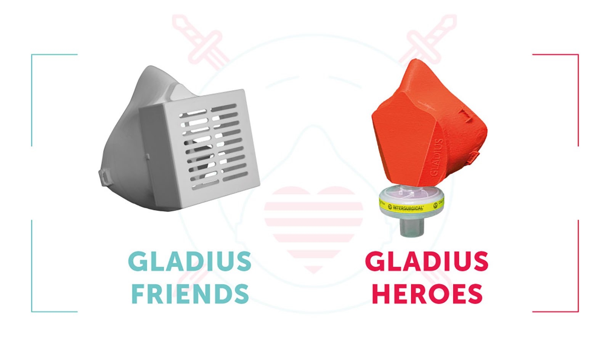
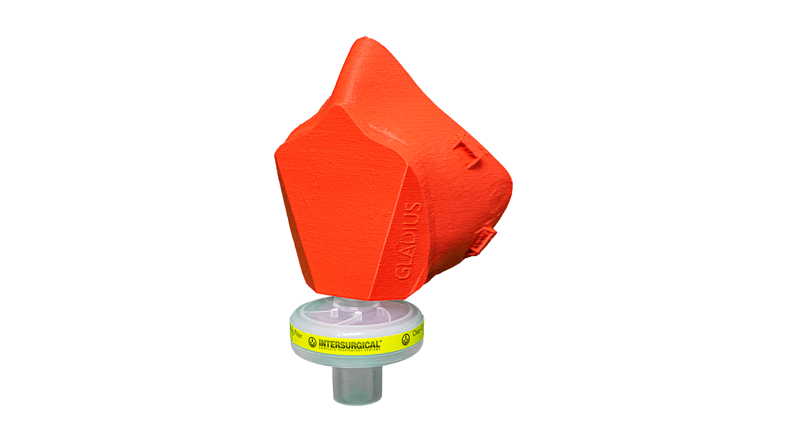
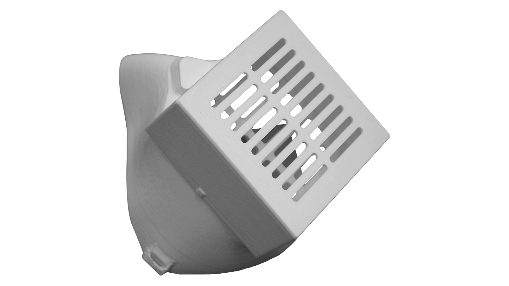

Gladius respirator is a symbol of combating the coronavirus pandemic. The first prototype was developed by David Kvaternik, one of the project's idea leaders to protect his family in the uncertain time of the pandemic. David, an expert in VR/AR and 3D modelling scanned both, his own and his wife’s face and used the scans to create a generic version of respirator in two sizes fitting the human face. David has designed and 3D printed the first prototypes that were tested by doctors in a hospital in Slovenia using various filter media. Based on the feedback of medical professionals the design was further improved and the Respirator with HEPA filter was then released to the Open-Source community. David’s idea inspired Ales Pevc and Doroteja Maklin. Together the three of them  initiated a team of experts and supporters to create a community initiative in Slovenia which is driven by the vision that everyone can actively help protect lives. In the following days an core team supported by experts in design, microbiology, physics, public relations, business development, education,  health and medicine started planning and taking steps to supply the masks and respirators to both front line and second line workers as soon as possible.

To do so, a map of available 3D printing machines in Slovenia was created and makers were encouraged to print the Gladius Heroes respirator. The initiative was named Zascitimo Slovenijo (Protect Slovenia) to unite and initiate makers to help fight the pandemic.

The respirator design was continuously improved with the help of medical professionals and the idea of using existing breathing filters already available in most health centers was a leaver to design a new respirator customised to fit that effective, affordable and commonly available filter.

The core team is working 24/7 to design, test and offer new designs to Open-Source community so make sure you monitor this page regularly for the latest updates.

# Versions

## <i class="fab fa-superpowers"></i> Gladius Heroes respirator mask
* <a href="https://github.com/dkvaternik/GLADIUS/tree/master/Microbiological%20Breathing%20Filter%20Face%20Mask" target="_blank">Download files for MEDIUM mask here</a>

### What do you need?
* 3D printer (model is not important)
* 3D model of the respirator
* PLA filament
* Breathing Filter*

*Breathing filters are stocked in most health centres and hospitals as an accessory for ventilators. The model of the filter used to design the respirator is certified to 99.99% efficiency. The filter the mask was designed for can be found <a href="https://www.intersurgical.com/products/airway-management/clearguard-range-medium-efficiency" target="_blank">here</a>.

### 3D print settings

* Rafts: No
* Supports: No
* Resolution: 0.2
* Infill: 15%
* Filament material: PLA
* Filament brand: Trcek (or use any PLA brand that you trust)

* Notes: **No supports needed**. We recommend 3 perimeters. PLA is used for it's relative non-toxicity and personalization/fitting options.
* Printing position: The mask **must be printed** in the original orientation (vertically), as otherwise the filter seal could be compromised

***

## <i class="fal fa-users"></i> Gladius Friends respirator mask
* <a href="https://github.com/dkvaternik/GLADIUS/tree/master/HEPA%20Filter%20Face%20Mask" target="_blank">Download files for SMALL mask here</a>
* <a href="https://github.com/dkvaternik/GLADIUS/tree/master/HEPA%20Filter%20Face%20Mask" target="_blank">Download files for MEDIUM mask here</a>

### What do you need?
* 3D printer (model is not important)
* 3D model of the respirator mask
* PLA filament
* filter material

### Recommendations for production
* Rafts: No
* Supports: No
* Resolution: 0.2
* Infill: 50%
* Filament material: PLA
* Filament brand: <a href="https://plastikatrcek.si/" target="_blank">Trcek</a> (or use any PLA brand that you trust)

### Filter installation
* There is a variety of filter materials available with different specifications that may be used  in the time of crisis and are scientifically supported. NASA <a href="https://ntrs.nasa.gov/archive/nasa/casi.ntrs.nasa.gov/20170005166.pdf" target="_blank">researched HEPA filter properties</a> and <a href="https://www.researchgate.net/profile/Katy-Anne_Thompson2/publication/258525804_Testing_the_Efficacy_of_Homemade_Masks_Would_They_Protect_in_an_Influenza_Pandemic/links/53fefd8f0cf21edafd154e85/Testing-the-Efficacy-of-Homemade-Masks-Would-They-Protect-in-an-Influenza-Pandemic.pdf" target="_blank">researchers from Cambridge University</a> tested multiple domestic materials that may be used as filters
* It is recommended that whichever filter material is selected, it is carefully cut into 60 x 60mm square and tightly glued into the mask cover. Adhesive that can withstand up to 70 degrees Celsius must be used. Please avoid harmful materials and respect the manufacturer's instructions on application.
* The adhesive must dry completely according to the manufacturer's instructions.

### Gladius mask may be reused with right disinfection and sterilization
With right disinfection and sterilization, the mask is reusable. Coronavirus is a heat-sensitive virus and becomes inactive when heated to 56° C for 15 minutes  <a href="#references">1</a><a href="#references">2</a>. Experts state that at the time of rationing during the outbreak of coronavirus in China, masks were sterilized and reused <a href="#references">3</a>. They proved to successfully deactivate the virus during dry sterilization (use of industrial oven heat) at 56° C.

Note, that it is very important how you handle the mask before the sterilization process, as it must at all times be treated as contagious (infected with a coronavirus).

### References
* <a href="https://www.hindawi.com/journals/av/2011/734690/" target="_blank">1 The Effects of Temperature and Relative Humidity on the Viability of the SARS Coronavirus: K. H. Chan , J. S. Malik Peiris, S. Y. Lam, L. L. M. Poon, K. Y. Yuen, and W. H. Seto (Department of Microbiology, The University of Hong Kong, Queen Mary Hospital, Pokfulam, Hong Kong), pridobljeno: 24. 3. 2020</a>
* <a href="https://www.who.int/csr/sars/survival_2003_05_04/en/" target="_blank">2 WHO, pridobljeno: 24. 3. 2020</a>
* <a href="https://mp.weixin.qq.com/s/3QYVWO4kj5qwuSHnhcM9uQ" target="_blank">3, pridobljeno: 24. 3. 2020</a>

# Disclamer

The participants of this project do not take any responsibility for the use, use cases, dangers from the manufacturing process, and outcomes of wearing this design (or designs derived from it), in any way, shape, or form; nor do we claim that this product offers medical-grade, or any kind of protection from COVID-19.

We realize and emphasize that this is a prototype, and should not be considered as offering protection from COVID-19.
Testing and certification of this face mask, from all aspects, from production, assembly, fitting and reusability, is currently under-way. Theuser and manufacturer of this mask assumes ALL RESPONSIBILITY for, including, but not limited to: manufacturing, modifying the design, fitting procedures, disinfection procedures, wear, use.

Also, it is not the purpose of this project to replace official certified medical equipment, but to offer an alternative to bandanas, coffee filters (we're hearing such sad stories from throughout Europe) etc.

It is an open-source, goodwill project, aiming to do the best we can to help each other in a very difficult situation.

# About Zaščitimo Slovenijo initiative

Gladius masks based on David Kvaternik design are developed by a team of volunteers from different industries to raise public awareness about the precautions in the time of the coronavirus pandemic, following the instructions of the NIJZ (National Institute of Public Health from Slovenia) and other official institutions (WHO, UKC - University Medical Centre from Slovenia…). Furthermore, the team would like to provide basic protective equipment for front line workers and other residents that need it in the shortest period of time. We will succeed together, as there are more and more of us, joining forces together!

We are truly grateful to everyone who, in these times of crisis, strains their brain and searches for solutions to help those in need of protection. We will make it together!

P.S.: If you have a tried and tested  solution or knows a case of good practice, please let us know: <a href="mailto:info@zascitimo.si">info@zascitimo.si</a>.
